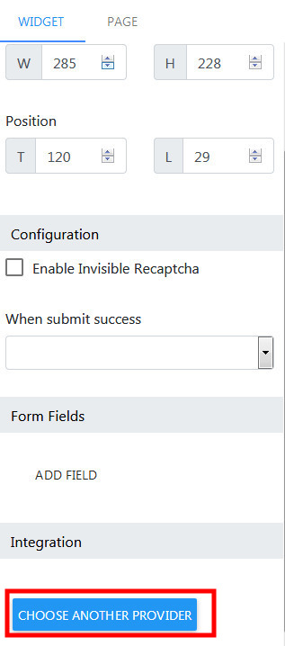
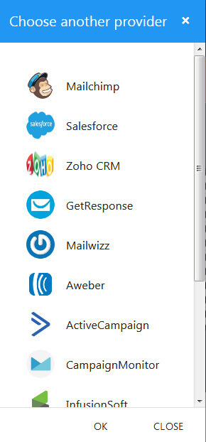

Form
==============

==============
Adding a Form
==============

- Open the Builder, drag the form widget to the builder canvas.

==============
Adding Form Fields
==============
- Select a Form in the Builder.

.. image:: https://landingmall.stsengine.com/wp-content/uploads/sites/5/2018/08/wwform.jpg

- On the right panel, scroll down to show to Form Fields section
.. image:: https://landingmall.stsengine.com/wp-content/uploads/sites/5/2018/08/wwform1.jpg
- Click on any option on the Form Fields section to add a new field to the form.

Note: Form automatic layout after insertion. Form will sorts its fields from top to bottom

==============
Form Integrations
==============
Form data submitted by user can be sent to 3rd party services (such as MailChimp, AWeber, GetResponse, etc.)
- Select a Form in the Builder.
- - On the right panel, scroll down to show to Integrations section, click Choose Provider button.

- In the Integration dialog, click your prefer service.

- Follow the next dialog to complete the integration.
