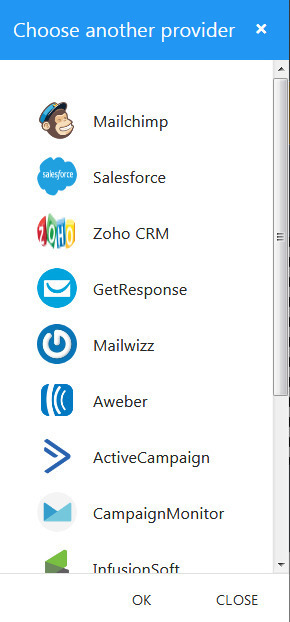
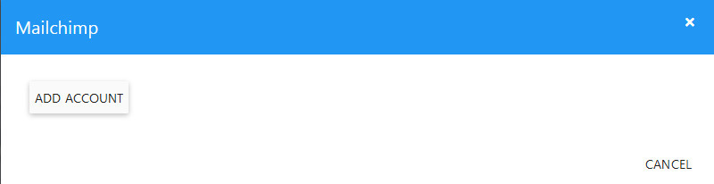
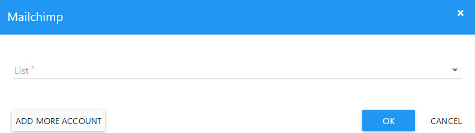

Form Integration
==============

==============
MailChimp
==============
.. NOTE:: you must have a MailChimp account before.

- In the Integration dialog, click MailChimp to open MailChimp dialog.

- Select Add Account in the next dialog.

- Now, use your mailchimp account to login.
- Back to the Builder, select a MailChimp list.

- Next, mapping your form fields with MailChimp fields.

.. image:: ../assets/images/mailchimp2.jpg

- Finally, click OK.

==============
Saleforces
==============

- In the Integration dialog, click Saleforces to open ZohoCRM dialog.

- Select Add Account in the next dialog.
- Now, use your Saleforces account to login.
- Back to the Builder, select a Saleforces campaign.

- Next, mapping your form fields with Saleforces fields.

- Finally, click OK.

==============
ZohoCRM
==============

- In the Integration dialog, click ZohoCRM to open ZohoCRM dialog.

- Select Add Account in the next dialog.
- Now, use your ZohoCRM account to login.
- Back to the Builder, select a ZohoCRM campaign.

- Next, mapping your form fields with ZohoCRM fields.

- Finally, click OK.

==============
Infusionsoft
==============

- In the Integration dialog, click Infusionsoft to open Infusionsoft dialog.

- Select Add Account in the next dialog.
- Now, use your Infusionsoft account to login.
- Back to the Builder, select a Infusionsoft campaign and a sequence.

- Next, mapping your form fields with Infusionsoft fields.

- Finally, click OK.

==============
Aweber
==============

- In the Integration dialog, click Aweber to open Aweber dialog.

- Select Add Account in the next dialog.
- Now, use your Aweber account to login.
- Back to the Builder, select a Aweber list.

- Next, mapping your form fields with Aweber fields.

- Finally, click OK.

==============
Hubspot
==============

- In the Integration dialog, click Hubspot to open Hubspot dialog.

- Select Add Account in the next dialog.
- Now, use your Hubspot account to login.
- Back to the Builder, select a Hubspot Form.

- Next, mapping your form fields with Hubspot fields.

- Finally, click OK.

==============
Getresponse
==============
.. NOTE:: you need a Getresponse API, :doc:`crm_config`.
- In the Integration dialog, click Getresponse to open Getresponse dialog.

- Select Add Account in the next dialog.
- Fill your Getresponse API in the API field. Click OK.

- Back to the Builder, select a Getresponse list.

- Next, mapping your form fields with Getresponse fields.

- Finally, click OK.