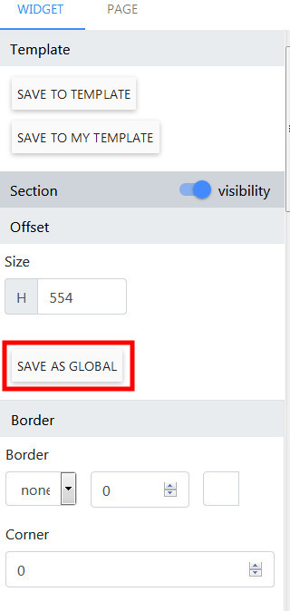
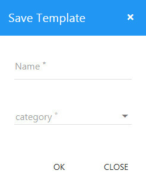
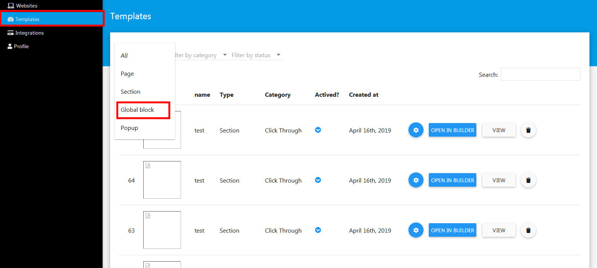
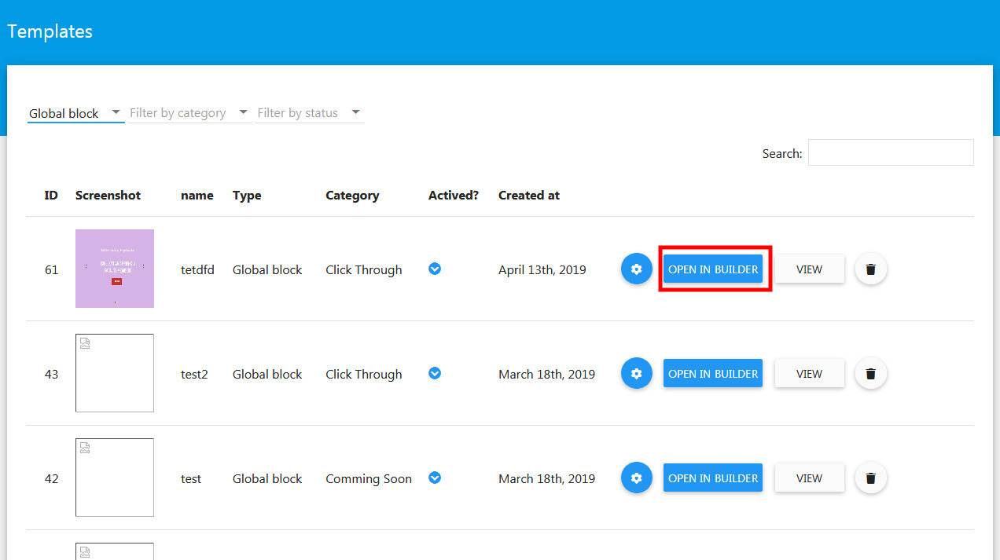
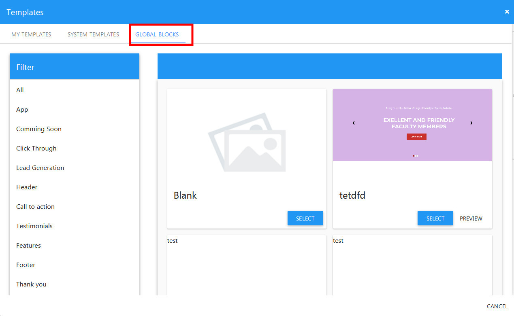

Global Block
==============

Global block is a user section marked as global, it can embed multiple landing pages and allow customers to update multiple pages just with one click. 

==============
Create a global block
==============

- Open the Builder, select a prefer section.

- On the right panel, click Save as Global.

- Select name of block and its category then click OK.

- Next, click Save on the top header to save the landing page.

==============
Edit a global block
==============

- Loggin with url your_site_url/profile

- Click Template menu.
- Next, in the Template list page, click to the Filter by type dropdown, select Global Block.

- Now, find your global block then click Open In Builder

- 

==============
Embed a global block
==============

- Open a landing page you want to embed the global block.
click Add Section button located on left side of the header.

- Next, in the Templates dialog, click Global Block tab.

- Select the prefer section then click Select.

