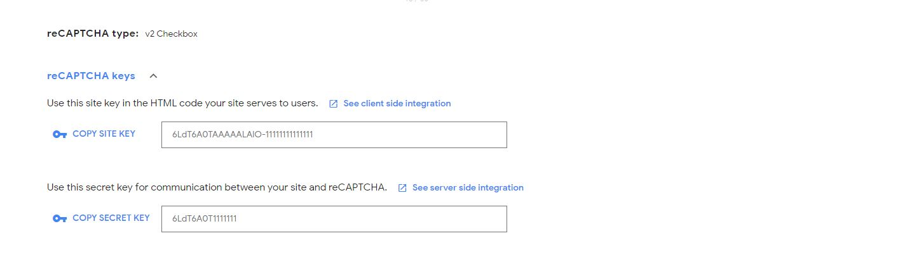

Google Recaptcha
==============
.. Note:: If you do not have a Google account, you will need to sign up for a Gmail account. You can do this for free https://accounts.google.com/signup/v2/webcreateaccount?service=mail&flowName=GlifWebSignIn&flowEntry=SignUp.

- Log into https://www.google.com/recaptcha/admin with your Google account .

- You are now required to login with your Google account, if you do not have one, register for a free account.
- Once you're logged in with your Google account, you will be presented with an interface to generate api keys for your website
==============
Register your website
==============
- In order to register a website, simply type anything into the "label" field of the form. For example you can type the name of your website.
- Select  reCAPTCHA v2 then  tick Invisible reCAPTCHA badge.
- Type your website domain into the "Domains" field of the form, like displayed above.

- Once you've filled the whole form, press the "Register" button. 

- If everything is correct, you will be redirected to a new page with your new api keys ready to be used. 

- Take note of the site key and secret key:

