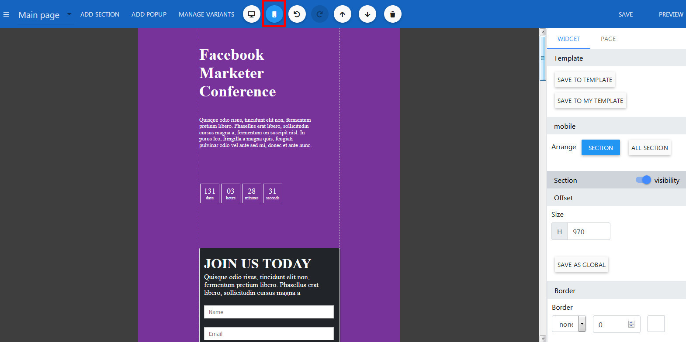
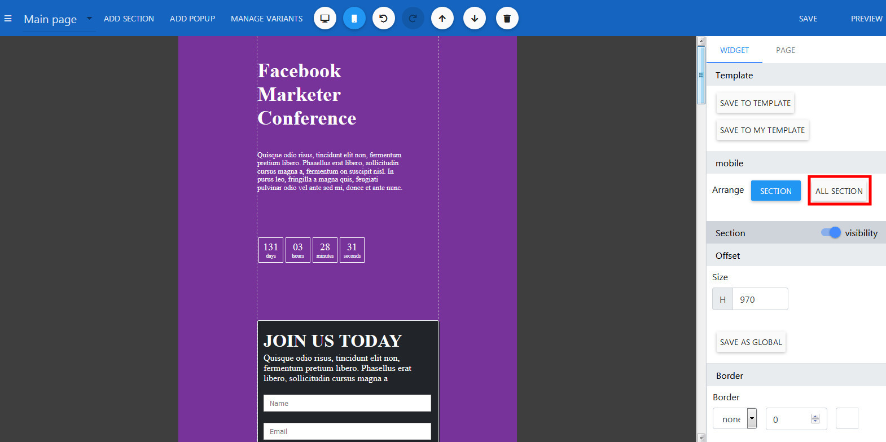

Mobile Editor
==============

==============
Switching to Mobile mode
==============
- Open the Builder.
- Click the mobile button on the top header.

==============
Auto optimized
==============
- Still in the Mobile mode, click on any section.
- On the right panel, click button Arrange All Section.

