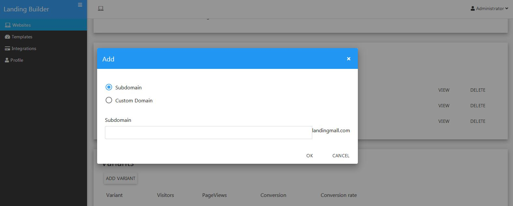
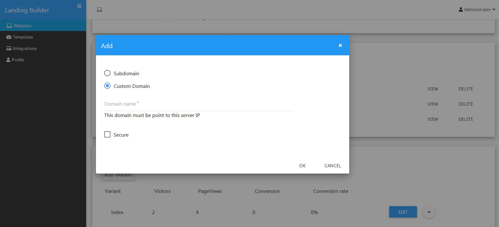

Publishing & Domain names

==============

If you want to allow your end-users to publish their landing page(s) using their own domain names, like yourdomain.com, you will need to complete the following steps:

Configure local DNS on the server hosting your copy of LandingMall. You will need to instruct your server to direct requests for the custom domain to the folder on the server containing your LandingMall code
Create a DNS record for the custom domain which points to your LandingMall server. This needs to be completed at the main nameserver for the custom domain (typically, this is a step your end-users will need to complete themselves, as it requires access to the domain’s DNS records).

- Loggin with url your_site_url/profile
- Select relevant website then click Select
.. image:: https://landingmall.stsengine.com/wp-content/uploads/sites/5/2017/11/publish_website.jpg
- In the website details, scroll down to Domains section, click Add Domain
.. image:: https://landingmall.stsengine.com/wp-content/uploads/sites/5/2017/11/publish_website1.jpg

==============
Subdomain
==============

- In the Domain Dialog, select Subdomain. 
- Type your subdomain and click Save.

==============
Custom Domain
==============

- In the Domain Dialog, select Custom Domain. 
- Type your domain(without http or https) and click Save.

==============
Subfolder
==============

- In the Domain Dialog, select Custom Domain. 
- Type your domain(without http or https) with subfolder(ex: yourdomain.com/myladingpage) and click Save.

